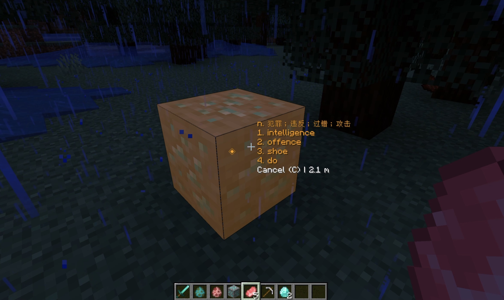
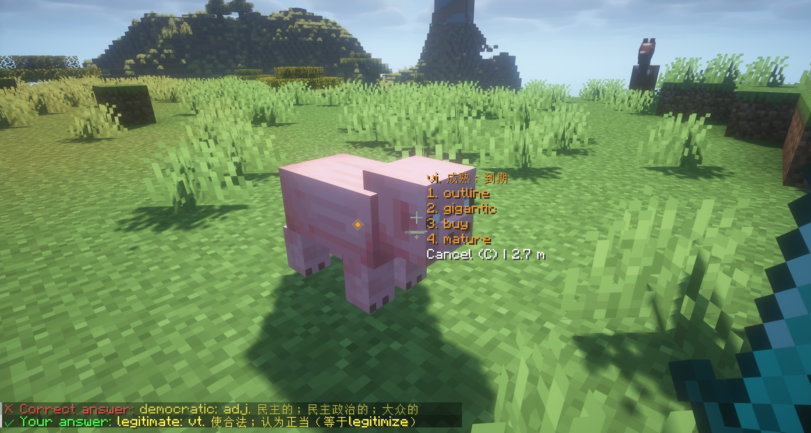

     

<h1 align="center">QuizCraft</h1>

A Minecraft Fabric mod that adds an Apex Legends-style quiz system to the game.

## Features

### Manual Ping
- Press **C** key to create pings by looking at blocks or entities
- Supports two types of pings:
  - **Location pings** for blocks
  - **Entity pings** for entities (makes them glow for 5 seconds)

### Automatic Ping Hooks with Event Blocking *(New Feature)*
The mod now automatically creates pings and **blocks the original action** until the ping is cancelled:

- **Attacking enemies**: When you attack any entity, the damage is intercepted and blocked while preserving other attack effects (knockback, sound, etc.). A ping is created on the entity, and the damage is applied when the ping is manually cancelled (by pressing C on the ping).
- **Mining ores**: When you try to break an ore/mineral block, the break action is intercepted and blocked. A ping is created on the ore, and the ore only breaks when the ping is manually cancelled.
  - **Supported ores**: Coal, Iron, Gold, Diamond, Emerald, Lapis, Redstone, Copper, Nether Gold, Nether Quartz, Ancient Debris, and all Deepslate variants

**Key Features:**
- **Damage is healed back** while preserving ALL attack effects (knockback, sound, animations, invincibility frames, etc.)
- **Block breaking is completely blocked** for ore blocks until ping cancellation
- Event data (damage amount, damage source, block state) is stored and preserved
- When ping is cancelled, the original damage is re-applied
- Automatic timeout mechanism prevents permanent blocking
- Server-side implementation with Mixin ensures security and 100% effect preservation

### Configuration
- Customizable ping colors, sounds, and other settings via ModConfig
- Multiple sound options including custom ping sounds

### Networking
- Multiplayer support with automatic ping synchronization
- Entity glow effects are synchronized across all players

## Installation

1. Install [Fabric Loader](https://fabricmc.net/use/)
2. Install [Fabric API](https://modrinth.com/mod/fabric-api)
3. Download and place the QuizCraft mod jar in your `mods` folder

## Demo

https://github.com/user-attachments/assets/7e82a44f-a1c7-4b74-894b-f17895c69a40

## Controls

- **C**: Create manual ping (configurable in key bindings)
- **C (on existing ping)**: Cancel ping and execute any blocked actions
- **Attack Entity**: Automatically creates entity ping and blocks the attack until ping is cancelled
- **Mine Ore**: Automatically creates ore ping and blocks the break until ping is cancelled

## Technical Details

The mod uses Fabric's event system and Mixin for comprehensive effect preservation:
- `AttackEntityCallback.EVENT` for entity attack detection and ping creation
- `@Mixin(LivingEntity.class)` with `@Inject` at `@At("RETURN")` on `damage()` method for healing back damage
- `PlayerBlockBreakEvents.BEFORE` for ore block break detection and blocking

**Attack Effect Preservation Architecture:**
- Attack events are intercepted to create pings but allowed to proceed completely (preserving ALL effects)
- Mixin intercepts `LivingEntity.damage()` method **after** it completes, healing back the exact damage amount
- This preserves 100% of attack effects: knockback, sound, animations, invincibility frames, armor calculations, etc.
- Block break events are completely blocked for ore blocks
- Original event data is stored in memory with unique ping IDs that match the created pings
- When a specific ping is cancelled, the stored damage is re-applied to the entity
- Automatic cleanup of expired blocked events (30-second timeout) prevents memory leaks
- Thread-safe concurrent data structures ensure proper synchronization

All pings are processed through the same unified system and support the full feature set including networking, rendering, and sound effects.