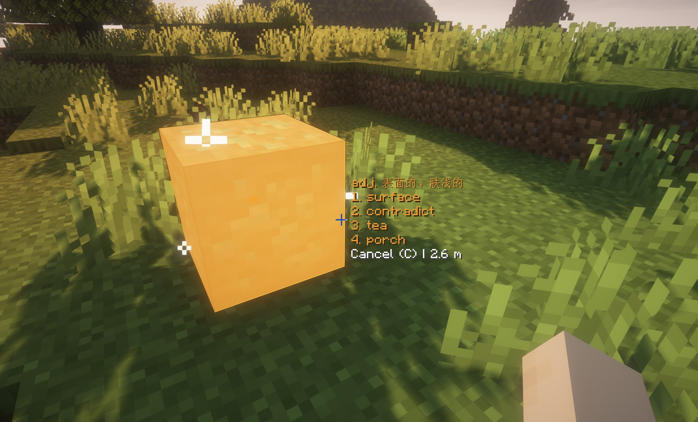

     

<h1 align="center">QuizCraft</h1>

## 🎯 Transform Your Minecraft Into an Educational Battleground

**QuizCraft** combines the tactical excitement of Apex Legends with English vocabulary learning, creating the most engaging way to improve your language skills while playing Minecraft!

### ⚡ What Makes QuizCraft Special?

- **🔥 Apex Legends-Inspired Ping System**: Experience authentic battle royale communication with iconic sound effects and visual pings
- **📚 Comprehensive Vocabulary Libraries**: Choose from 18 different English test preparations including CET-4/6, IELTS, TOEFL, TEM-4/8, and NEEP
- **🎮 High-Stakes Learning**: Your mining and combat actions trigger vocabulary quizzes - answer correctly for rewards, incorrectly for penalties!
- **⚔️ Combat Quiz System**: Attack entities to generate quiz challenges with real consequences for your gameplay
- **💎 Mining Quiz Mechanics**: Breaking ore blocks requires vocabulary knowledge - get it wrong and lose your pickaxe!

### 🎵 Immersive Audio Experience

Featuring authentic Apex Legends sounds including:
- Combat callouts and weapon sounds (Wingman, Mozambique, Kraber)
- Shield break celebrations and knockdown effects  
- Legendary voice lines from fan-favorite characters
- Tactical ping audio for team coordination

### 🏆 Risk & Reward System

**Correct Answers:**
- 🛡️ Gain Strength effects in combat
- 💰 25% chance for double ore drops
- 🎊 Satisfying victory sounds and effects

**Wrong Answers:**
- 💔 Take damage as punishment
- ⛏️ Risk breaking your tools
- 📉 Miss out on valuable resources

### ⚙️ Server Administration

- **OP-only server configuration** with in-game GUI (`/quizconfig`)
- **Real-time vocabulary book switching** across all test types
- **Customizable quiz timeouts** and highlight colors
- **Team-based ping system** (configurable)

### 🌟 Perfect For:

- **English Language Learners** preparing for standardized tests
- **Minecraft Educators** seeking engaging teaching tools
- **Gaming Communities** wanting educational content
- **Apex Legends Fans** missing the tactical communication system

Turn every mining expedition into a vocabulary lesson and every combat encounter into a learning opportunity. With QuizCraft, education has never been this exciting!

